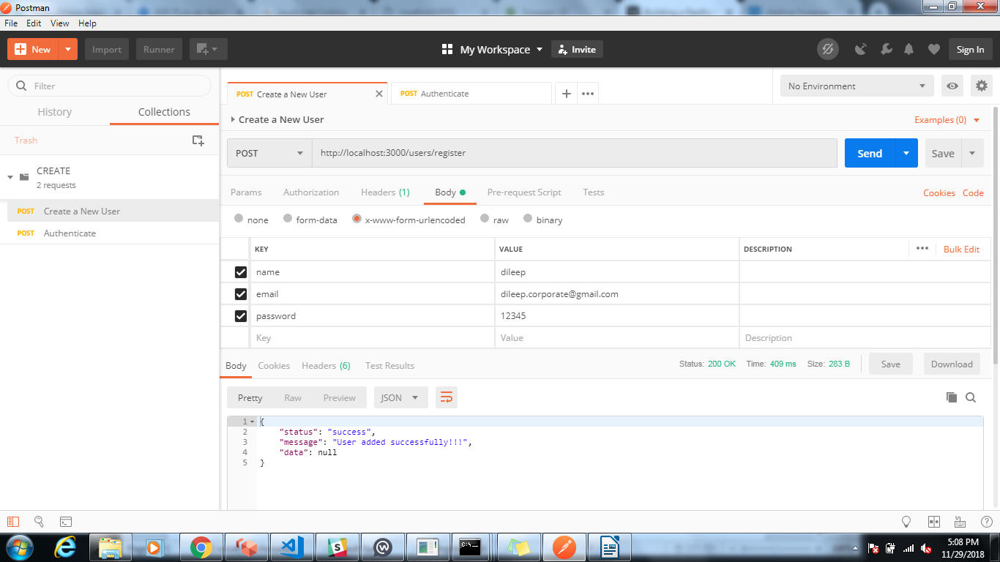
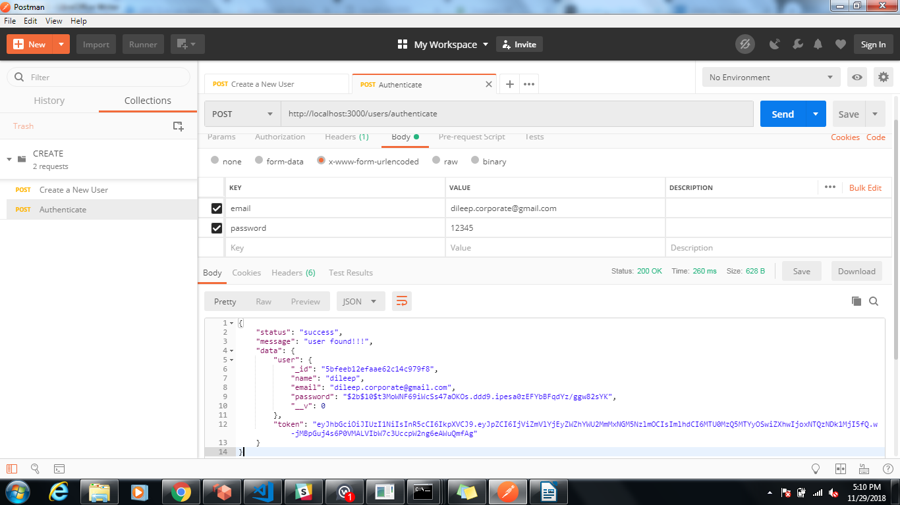
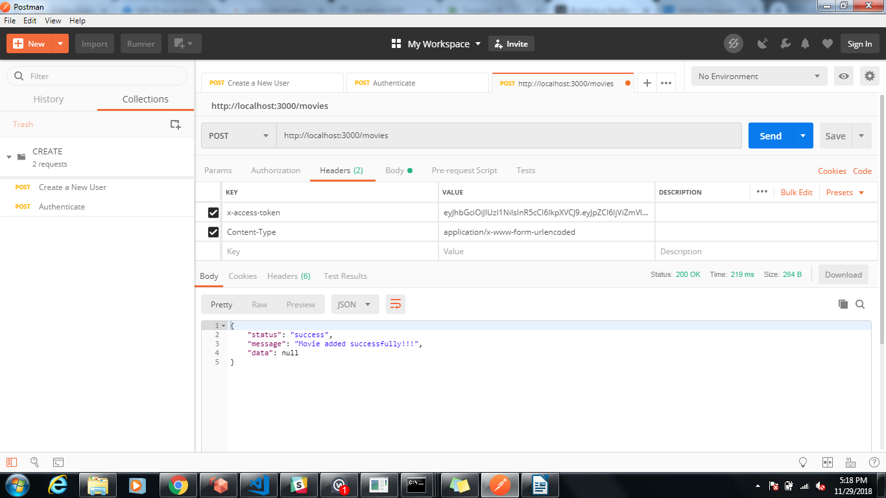
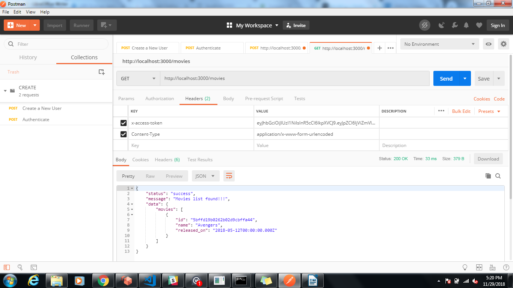
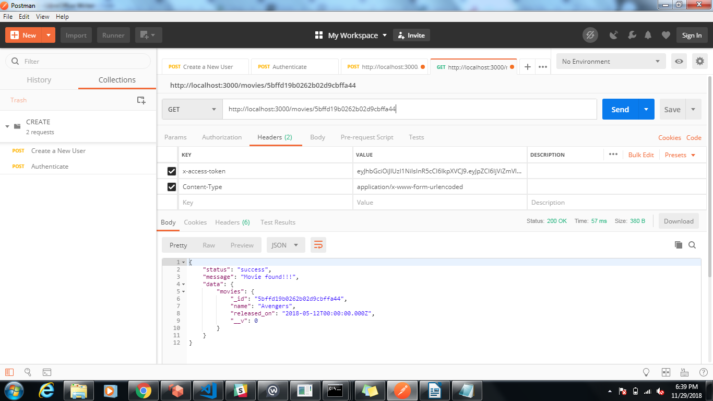
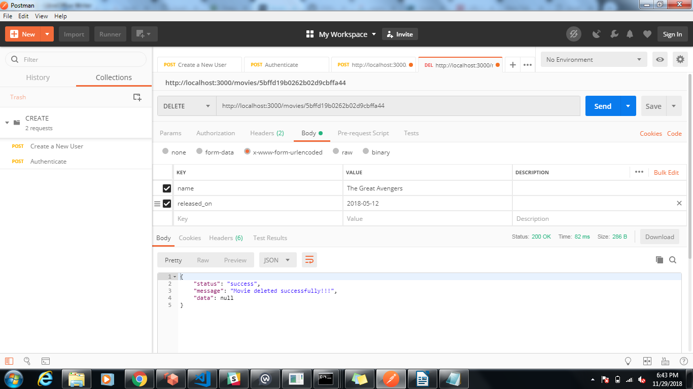
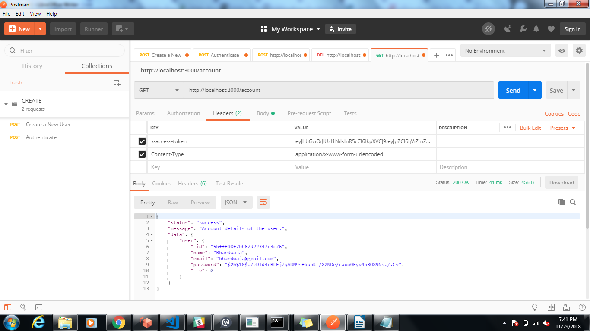

# nodejs-rest-api
Steps to run the APP. 

A) Create the folder and unzip the code.

B) Go to current create folder through terminal and run the command npm install(Insure node.js installed in the system).

C) Check for any error in the terminal,if any package is missing or unable to install.

D) When everything is successful , try to run "nodemon server.js or node server.js".

E) Have to run the mongodb.

F) Open your postman and type : http://localhost:3000/register

G) On the same address, change the method to POST, click body and select “x-www-form-urlencoded”. Then, enter name as the key and the corresponding task name as value.

http://localhost:3000/users/register 

http://localhost:3000/users/authenticate 

 POST    http://localhost:3000/movies 

JWT token received in above request will be used to access protected movie routes. We will pass token in header with key=x-access-token and value=jwt token 

 GET  http://localhost:3000/movies 

http://localhost:3000/movies/5bffd19b0262b02d9cbffa44 

http://localhost:3000/movies/5bffd19b0262b02d9cbffa44 

http://localhost:3000/movies/5bffd19b0262b02d9cbffa44 

http://localhost:3000/account 

